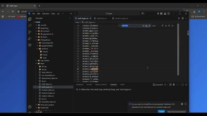

# St Jaga's College Management System

A Django-based web application for managing student, staff, department, and attendance information for St Jaga's College.


## Database

The project uses SQLite by default (`db.sqlite3` in the root folder). You can switch to MySQL or PostgreSQL by editing the `DATABASES` setting in `sms/settings.py`.

To set up the database:
1. Run migrations:
   ```
   python manage.py migrate
   ```
2. (Optional) Change database engine in `sms/settings.py` for MySQL/PostgreSQL and update credentials.
3. Media files (images, etc.) are stored in the `media/` folder.

## Project Preview

After starting the server (`python manage.py runserver`), you can preview the project at:

- Main page: [http://127.0.0.1:8000/](http://127.0.0.1:8000/)
- Student dashboard: [http://127.0.0.1:8000/dashboard/<student-slug>/](http://127.0.0.1:8000/dashboard/<student-slug>/)
- Staff dashboard: [http://127.0.0.1:8000/staff/dashboard/<staff-slug>/](http://127.0.0.1:8000/staff/dashboard/<staff-slug>/)
- Admin panel: [http://127.0.0.1:8000/admin/](http://127.0.0.1:8000/admin/)

### Demo




---
## Features
- Student and staff login and authentication
- Department-wise dashboards for students and staff
- Attendance tracking and visualization (table, pie, line, bar charts)
- Timetable management for classes and staff
- Student profile management
- Results and performance tracking
- Dynamic image and media management for departments and facilities
- Admin interface for managing users, classes, subjects, and attendance

## Technologies Used
- Python 3.13+
- Django 4.x+
- SQLite (default, can be switched to MySQL/PostgreSQL)
- HTML5, CSS3, JavaScript
- Chart.js for attendance visualization

## Project Structure
```
sms/
├── db.sqlite3
├── manage.py
├── media/
├── sms/
│   ├── settings.py
│   ├── urls.py
│   └── ...
├── staff/
│   ├── models.py
│   ├── views.py
│   ├── forms.py
│   └── ...
├── student/
│   ├── models.py
│   ├── views.py
│   ├── forms.py
│   └── ...
└── static/
    └── ...
```

## Setup Instructions
1. Clone the repository and navigate to the project folder.
2. Create a virtual environment and activate it:
   ```
   python -m venv dj_frame
   dj_frame\Scripts\activate  # Windows
   source dj_frame/bin/activate  # Linux/Mac
   ```
3. Install dependencies:
   ```
   pip install -r requirements.txt
   ```
4. Run migrations:
   ```
   python manage.py migrate
   ```
5. Create a superuser for admin access:
   ```
   python manage.py createsuperuser
   ```
6. Start the development server:
   ```
   python manage.py runserver
   ```
7. Access the app at `http://127.0.0.1:8000/`

## Usage
- Students and staff can log in to view their dashboards.
- Admins can manage users, classes, subjects, and attendance via the admin panel.
- Attendance can be filtered by date range and visualized in multiple formats.
- Department pages display staff, facilities, and course information.

## Media & Static Files
- Images and media are stored in the `media/` folder.
- Static files (CSS, JS) are in `student/static/` and `staff/static/`.

## Customization
- Update department/course/staff info via the admin panel or by editing models.
- Add new features by extending Django apps (`student`, `staff`).

## License
This project is for educational purposes at St Jaga's College.

## Contact
For support or questions, contact the project maintainer or college IT department.
